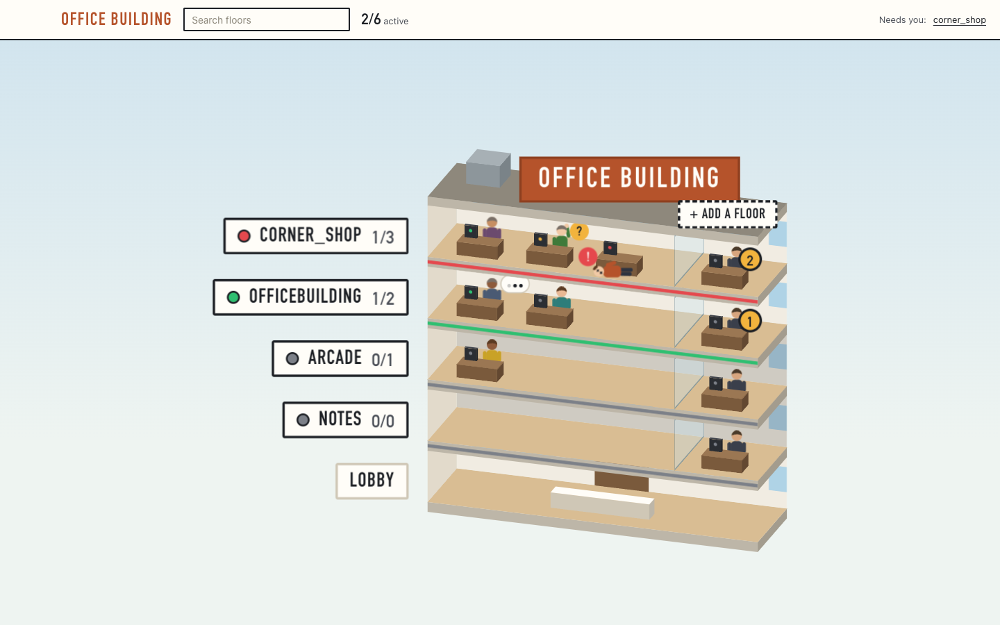
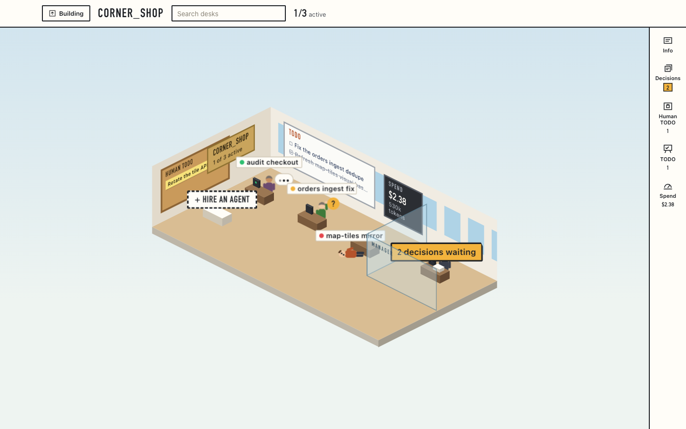
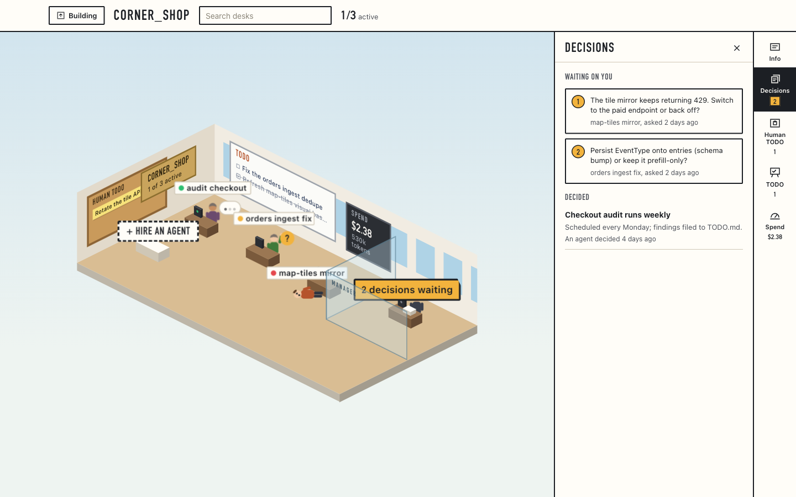

# Office Building



A macOS desktop app (Tauri v2) that visualises and orchestrates coding-agent
sessions as an **office building**:

- **Floors = projects.** The building is a 2.5D cutaway you can see into. A
  floor's status strip and nameplate lamp (green / yellow / red, off when nobody
  works there) signal whether that project needs attention.
- **Desks = agent sessions.** Each desk has a live, animated employee whose pose
  reflects the session state (typing, thinking, hand up for a question, lying on
  the floor when stuck). When a session ends its agent leaves; the floor stays
  for 12 hours after its last activity. A floor's light is green while an agent
  works, yellow when one needs you, red when one is stuck and grey when all are
  idle. Colleagues walk notes to each other's desks (agent-to-agent messages);
  new hires walk in. A session's running subagents, plain or in a workflow, sit
  at tiny desks beside its own. The desks shrink as the team grows, and past 64
  the rest show as a count.
- **The manager's panels are objects in the room**, and also sit on a rail at the
  right edge: brass plaque = Info, memo pile on the manager's desk = Decisions
  (questions ordered by priority → one question → A / B / Other), cork board =
  Human TODO, whiteboard = TODO, wall meter = Spend. Everything is scoped to the
  floor you are on.
- **Decisions and TODOs come from each repo's own files**: open and settled calls
  from `FOUNDER_DECISIONS.md` (or `HUMAN_DECISIONS.md`) plus the agents'
  `DECISIONS.md` log, your actions from `FOUNDER_TODO.md` (or `HUMAN_TODO.md`),
  agent work from `TODO.md`. A call is open until its `##` heading carries a
  status (`DECIDED <date>`, `CONFIRMED`, `VETOED`, `DEFAULT APPLIED`...). Under a
  heading that only groups calls, each `- [ ] **Title** …` item is a call and
  `- [x]` a ruled one, and so is each `### ID · Title · …` entry (settled when the
  group heading says Answered or Decided). Hyphenated names such as
  `FOUNDER-DECISIONS.md` and `FOUNDER-TODO.md` work too. Answering a call or ticking an item in the app writes
  back into the file (a checklist call gets ticked and a `**Ruled <date>:**` line).
  Repos without these files fall back to the app's own records.
- **Hire an agent** from the empty desk: pick the tool, the model and an effort
  level the model supports, and name the task.
- **Click an employee → their terminal.** App-spawned sessions get a full in-app
  terminal docked under the floor (PTY + xterm.js); closing the panel leaves the
  agent running. Discovered / hand-started sessions raise their **original
  native terminal window** instead.
- Sessions are **auto-discovered** from each tool's on-disk store (Claude Code
  first, then Codex, then opencode / antigravity), so terminals you started by
  hand still appear in the building.
- The app also exposes its **own MCP server** so assistant agents can drive the building programmatically.

| A floor | Its Decisions queue |
| --- | --- |
|  |  |

The screenshots show the browser build's mock data.

The visual identity (tokens, type, motion, the 3D rig's constraints) is recorded
in [`DESIGN.md`](DESIGN.md). Full design + research + locked decisions live in
[`docs/office-building-plan.md`](docs/office-building-plan.md). The backend
is based on `claude-command-center` (CCC) with our own office UI, sidebar, and
MCP surface layered on.

## Status

- **Frontend:** the full office UI, tested (Vitest, strict TypeScript, runtime
  validation of every backend payload in `src/api/wire.ts`).
- **Backend (Rust, `src-tauri/`):** discovers real **Claude Code** sessions from
  Claude's own files (`~/.claude/sessions/<pid>.json` for liveness and a
  session blocked on you, `~/.claude/projects/**.jsonl` for transcripts), groups
  them into floors by git root, derives each desk's state, queues open
  questions, permission prompts and plain-prose asks, and pushes live updates to
  the webview. Clicking a running
  desk focuses its exact iTerm2 or Terminal.app tab. Hiring starts the agent
  with the chosen model and effort in an in-app terminal: a pseudo-terminal
  (through your login shell, in the floor's folder) streamed to xterm.js, with
  the last 256 KiB kept for replay. Once the agent registers its session, its
  desk opens that terminal. Dropping a file (a screenshot, say) onto it types
  the file's path, as iTerm2 does, so Claude Code attaches the image. An agent that stops within 1.5 s of your login
  shell handing over to it (or while the shell's profile is still loading) fails
  the hire with what it printed. One that stops later, before it ever reached
  a desk, is reported in an error message. A hired Codex agent needs a task,
  since Codex only becomes visible once its first turn opens a session file,
  and a Claude Code task cannot be just a `claude` subcommand name such as
  `doctor`. The terminals belong to the app, so quitting the app closes them. **Codex** CLI sessions
  are discovered too, from `~/.codex/sessions/**/rollout-*.jsonl` (titles from
  `session_index.jsonl`). A Codex session counts as running while a `codex`
  process holds its rollout file open, so threads from the ChatGPT desktop app
  only ever show as finished.
  Spend is priced at public API list prices (`discovery/pricing.rs`), which is
  what the same work would cost through the API, not what a subscription bills.
- **Not yet:** answering in the app, the MCP server. See `TODO.md`.

The backend is our own. CCC (claude-command-center) moved to a non-commercial,
source-available licence on 2026-07-28, so we port logic only from its last MIT
release, v5.14.0 (see `docs/research/ccc-evaluation.md` and
`THIRD_PARTY_NOTICES.md`).

## Run

Install (pnpm only):

```bash
pnpm install
```

### In a browser (mock data)

```bash
pnpm dev        # Vite dev server on :5183
pnpm test       # Vitest
pnpm build      # production web build → dist/
```

Outside Tauri, `main.tsx` uses `MockApi` with a demo simulation (states change,
colleagues send notes, app-owned desks open a small fake shell), so the whole UI
works without a backend.

### The macOS app (real sessions)

Requires Rust (`rustup`) and Xcode's command line tools.

```bash
pnpm tauri:dev                                # native window on real data
pnpm tauri:build                              # bundle .app / .dmg
cd src-tauri && cargo test                    # Rust unit tests
cd src-tauri && cargo run --example scan      # print what discovery sees
```

To launch it from an icon, run `pnpm app:install`. This builds a release
`.app` and copies it to `~/Applications/Office Building.app`, where Spotlight,
Launchpad and the Dock can find it (to pin it, open the app and choose Options →
Keep in Dock). Run it again after pulling changes. The installed app does not
rebuild itself.

### Sensitive-information hooks

`pnpm install` points git at `.githooks/`. The pre-commit hook refuses a commit
that adds a secret (API keys, tokens, private keys, credential assignments, a
real `/Users/<name>/` path) or a file such as `.env` or `*.pem`. The pre-push
hook checks every commit being pushed, including ones made with `--no-verify`.
Private words, such as names of unpublished projects, go one per line in
`.githooks/sensitive.local.txt`, which is gitignored because committing it would
publish them. For a reviewed false positive, put `sensitive-ok` on the line.
`pnpm check:sensitive` sweeps the whole history.

`pnpm tauri:dev` starts its own Vite server on :5183, so stop `pnpm dev` first.
The Tauri crates are pinned to the 2.11 line to match `@tauri-apps/api`; move
both together. The app icon is generated from `src-tauri/icons/icon-source.svg`
(see `src-tauri/icons/README.md`).

## Layout

```
src/
  types.ts                # data model (mirrored by src-tauri/src/model.rs)
  api/
    DiscoveryApi.ts       # the backend seam: getSnapshot / subscribe / mutations / focusSession / terminals
    tauriApi.ts           # DiscoveryApi over Tauri commands and the snapshot and terminal events
    wire.ts               # zod schemas that validate every backend payload
    mockApi.ts            # in-memory implementation for the browser, plus the demo simulation
    mockData.ts           # seed office (projects, sessions, questions, …)
  state/
    selectors.ts          # floor lights, search, per-floor queues/TODOs/spend, labels
    useOffice.ts          # load + subscribe hook with loading / error / retry
  lib/
    iso.ts                # camera + projection maths for the CSS 3D rig
    layout.ts             # where desks, seats and the manager's office stand
    animation.ts          # session state → employee pose, status colours
    looks.ts, time.ts     # stable per-agent looks, true relative times
  scene/                  # 3D primitives (IsoBox, Wall, Billboard, Stage) + people
  components/
    building/             # the cutaway: storeys, lobby, roof, directory bar
    floor/                # the room, its objects, rail, sidebar panels, terminal, hire dialog
  styles/                 # tokens (from DESIGN.md) and signage chrome
  App.tsx                 # view-state machine (building ↔ floor) + toasts

src-tauri/
  src/
    model.rs              # serde mirror of types.ts (camelCase / kebab-case)
    discovery/            # Claude Code and Codex sources, state rules, floor assembly
    office.rs             # discovery + the app's own records behind one lock
    store.rs              # decisions, TODOs, agent notes (JSON in the app data dir)
    options.rs            # hireable tools, models and per-model efforts
    focus.rs              # focus a session's terminal tab, the folder picker
    pty.rs                # in-app terminals for hired agents: PTY, output events, scrollback
    watch.rs              # file watch + tick → office://snapshot
    commands.rs           # #[tauri::command] fns backing DiscoveryApi
    lib.rs / main.rs      # Tauri wiring
  examples/scan.rs        # print what discovery sees on this Mac
  capabilities/default.json
  tauri.conf.json
```

## Open work

Tracked in [`TODO.md`](TODO.md).

## Licence

MIT, see [`LICENSE`](LICENSE). Parts of the session-state rules and terminal
focusing are ported from Claude Command Center v5.14.0 (MIT), see
[`THIRD_PARTY_NOTICES.md`](THIRD_PARTY_NOTICES.md).
